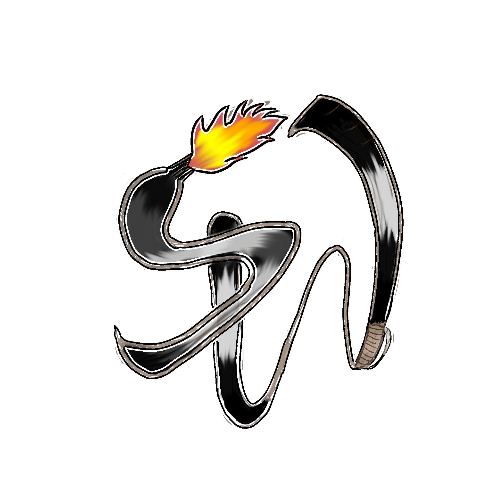

<p align="center">
  
</p>

<h1 align="center"> Sword & Wand </h1>

<p align="center">
  <strong>A 2D side-scrolling action RPG built with Python & Pygame</strong>
</p>

<p align="center">
  
  
  
  
  
</p>

---

## 📖 About

**Sword & Wand** is a pixel-art action RPG featuring procedurally generated worlds, multiple playable characters, a skill shop system, combo-based combat, and progressive difficulty scaling. Players explore an infinite side-scrolling dungeon, fight diverse enemy types, collect loot from treasure chests, and level up to become stronger.

Built as an academic project by **BSIT 1D** under the **BONFIRE BASE STUDIO** organization.

---

## ✨ Features

### 🎮 Core Gameplay
- **Infinite Procedural World** — Deterministic chunk-based world generation with seeded RNG for consistent level layouts
- **Two Playable Characters** — Choose between the agile **GraveRobber** or the powerful **Woodcutter**, each with unique stats, animations, and skill sets
- **Combo System** — Chain specific key sequences for devastating combo attacks that deal **5x damage** and restore HP
- **Progressive Difficulty** — Enemy HP, damage, count, and aggression scale the further you explore

### ⚔️ Combat & Skills
| Skill | Key | Unlock |
|-------|-----|--------|
| Basic Attack | `SPACE` | Lv 1 |
| Skill 1 (Lunge / Slash) | `E` | Lv 2 |
| Skill 2 (Rage / Spin) | `Q` | Lv 4 |

### 🛒 Shop System (6 Purchasable Upgrades)
| Upgrade | Cost | Effect |
|---------|------|--------|
| **Double Dash** | 50c | Air dash after jumping |
| **Regen Health** | 25c | Passively regenerate HP while idle |
| **CD Reduction** | 100c | Halve all skill cooldowns |
| **Titan's Grip** | 50c | Extend attack reach by 30% |
| **Executioner's Blow** | 150c | 20% chance to deal double damage |
| **Spiked Armor** | 100c | Reflect damage back to attackers |

> **Note:** Only **2 skills** can be equipped at a time.

### 🎨 Visual & Audio
- Animated pixel-art characters with multiple animation states (idle, run, jump, attack, hurt, death)
- Parallax scrolling backgrounds with layered sky, clouds, and flora
- Procedural tileset rendering for ground and platforms
- Screen shake effects on heavy attacks
- Floating damage numbers with color-coded types
- Animated treasure chests and flying stone platforms
- Custom splash screen with particle effects
- Separate BGM tracks for lobby and gameplay
- Fullscreen and windowed display modes

### 💾 Persistence
- **SQLite database** (`save_data.db`) for persistent player stats
- Auto-save on coin collection, level-ups, and skill purchases
- Full data reset option from the Options menu

---

## 🏗️ Architecture

```
sword-wand/
├── main.py              # Entry point — game loop, input handling, state machine
├── save_data.db         # SQLite database (auto-generated)
├── assets/
│   ├── bgm/             # Background music (lobby.mp3, gameplay.mp3)
│   ├── characters/      # Character sprite sheets (GraveRobber, Woodcutter)
│   ├── enemy/           # Enemy sprite sequences (Monster_1 through Monster_10)
│   ├── font/            # Custom font (Sekuya)
│   ├── images/          # Logo, lobby background
│   └── craftpix-net-*/  # Tileset, spikes, chests, flying stones, backgrounds
└── src/
    ├── __init__.py
    ├── config.py         # Constants: screen dimensions, tile size, game states
    ├── state.py          # Global mutable game state (HP, XP, skills, etc.)
    ├── db.py             # SQLite persistence layer (CRUD for player stats)
    ├── entities.py       # Player, Enemy, Coin, Spike, FlyingStone classes
    ├── sprites.py        # SpriteSheet, SequenceSheet, AnimatedSprite engine
    ├── level.py          # Level definitions and tile-grid loader
    ├── game.py           # Core game loop: physics, world gen, rendering, combat
    ├── lobby.py          # Lobby screen, shop, character select, options, help
    ├── ui.py             # In-game HUD, pause/game-over/victory overlays
    └── utils.py          # Font caching utility
```

### State Machine

```
┌─────────┐     ┌─────────┐     ┌──────┐
│  LOBBY  │────▶│  STORY  │────▶│ GAME │
└─────────┘     └─────────┘     └──────┘
     ▲               │              │
     │               │         ┌────┴────┐
     │               ▼         ▼         ▼
     │          ┌─────────┐  ┌─────┐  ┌─────────┐
     └──────────│  LOBBY  │  │PAUSE│  │GAME OVER│
                └─────────┘  └─────┘  └─────────┘
                                │          │
                                └──────────┘
                                  restart
```

---

## 🚀 Getting Started

### Prerequisites

- **Python 3.10+**
- **Pygame 2.x**

### Installation

```bash
# Clone the repository
git clone https://github.com/BONFIREBASE/sword-wand.git
cd sword-wand

# Install dependencies
pip install pygame

# Run the game
python main.py
```

The game launches in **fullscreen mode** by default. Toggle fullscreen from **Options** in the lobby.

---

## 🎮 Controls

### Movement
| Key | Action |
|-----|--------|
| `A` / `D` or `←` / `→` | Move left / right |
| `W` or `↑` | Jump |
| `S` or `↓` | Drop through platform |

### Combat
| Key | Action |
|-----|--------|
| `SPACE` | Basic attack |
| `E` | Skill 1 (unlocks at Level 2) |
| `Q` | Skill 2 (unlocks at Level 4) |

### Combos
| Character | Sequence | Effect |
|-----------|----------|--------|
| **GraveRobber** | `SPACE → E → Q → SPACE` | 5x damage + HP restore |
| **Woodcutter** | `W → E → Q → SPACE` | 5x damage + HP restore |

### General
| Key | Action |
|-----|--------|
| `ESC` | Pause / Back / Exit |
| `R` | Restart (while paused) |
| `M` | Return to lobby (while paused) |

---

## 🧑‍🤝‍🧑 Characters

### GraveRobber
- **Playstyle:** Fast & Agile
- **Speed:** 8 | **Jump Power:** -44 | **Gravity:** 3.2
- **Skill 1 (E):** Forward lunge with blade strike
- **Skill 2 (Q):** Multi-directional spinning slash (i-frames included)

### Woodcutter
- **Playstyle:** Heavy & Strong
- **Speed:** 6 | **Jump Power:** -40 | **Gravity:** 3.5
- **Skill 1 (E):** Leap strike with area-of-effect ground slam
- **Skill 2 (Q):** Rage mode — repeated aerial ground pounds with increasing AoE

---

## 👾 Enemies

| Enemy | Behavior | Notes |
|-------|----------|-------|
| Monster 1 | Ground patrol | Basic enemy |
| Monster 2 | Flying patrol | Airborne, hovers near stones |
| Monster 3 | Flying patrol | Airborne variant |
| Monster 4 | Flying patrol | Airborne variant |
| Monster 10 | Ground walker | Stronger ground enemy |

- **35% of enemies** are **chasers** that aggro and pursue the player
- **Cache encounters**: Dense loot areas spawn elite guard enemies
- Enemy stats scale with distance from spawn (HP ×2.5 per tier, damage ×0.15 per tier)

---

## 🛠️ Tech Stack

| Component | Technology |
|-----------|------------|
| Language | Python 3.10+ |
| Game Engine | Pygame 2.x |
| Database | SQLite3 |
| Art Style | Pixel Art (48×48 character sprites, 32×32 tileset) |
| World Gen | Seeded procedural generation |
| Font | Sekuya Regular (custom) |

---

## ⚠️ License

**All Rights Reserved** — © 2026 BONFIREBASE STUDIO

This repository is made available for **viewing and educational purposes only**. Unauthorized copying, modification, distribution, or use of this code without explicit written permission from the BONFIRE BASE Studio organization is strictly prohibited.

To contribute or request access, please contact the repository maintainers.

---

## 🤝 Contributing

Contributions are welcome from **authorized collaborators only**.

1. Request access from the BONFIRE BASE Studio organization
2. Fork the repository (collaborators only)
3. Create a feature branch (`git checkout -b feature/your-feature`)
4. Commit your changes (`git commit -m "feat: add your feature"`)
5. Push to the branch (`git push origin feature/your-feature`)
6. Open a Pull Request


